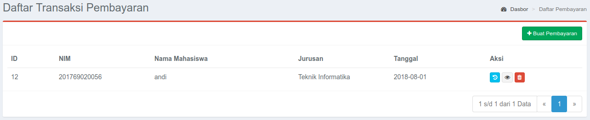
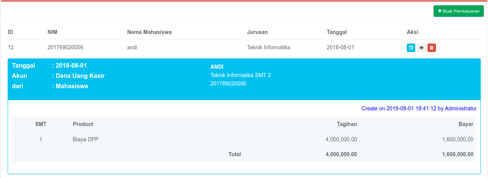
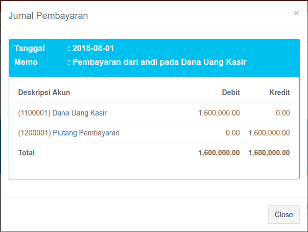
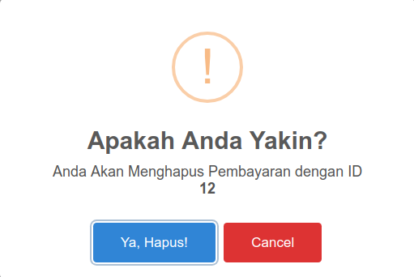
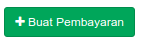

# Pembayaran

## Daftar Transaksi Pembayaran

Pada menu pembayaran akan ditampilkan daftar transaksi pembayaran yang telah tersimpan didalam database.

pada setiap item pembayaran ada 3 aksi,  lihat detail item, lihat jurnal, dan hapus data.

button lihat detail pembayaran akan menampilkan daftar product yang sudah dibayar oleh mahasiswa.

button lihat jurnal untuk melihat jurnal pembayaran yang telah dibuat oleh system.

button hapus data digunakan untuk menghapus transaksi pembayaran beserta jurnalnya dari database.

## Buat Transaksi Pembayaran

Pada daftar transaksi pembayaran klik tombol  maka halaman akan dialihkan ke form pembayaran.

untuk melakukan transaksi pembayaran lakukan langkah sebagai berikut:

1. Pilih Tanggal Transaksi. (default hari ini).
2. Pilih Akun Kas.
3. Masukkan NIM Mahasiswa.
4. Bayar Tagihan dengan cara klik kanan untuk menambah cicilan dan klik kiri untuk mengurangi cicilan.
5. Edit Hak Akses Mahasiswa.
6. Simpan Transaksi.
